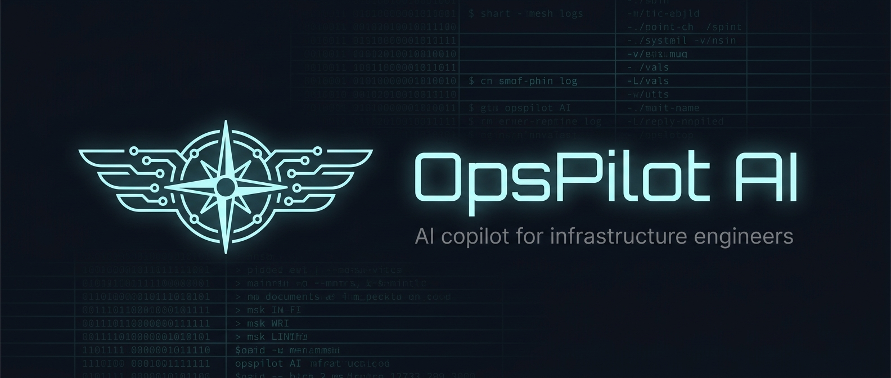

# OpsPilot AI



**The AI copilot for Systems Engineers, Cloud Engineers, Platform Engineers and Windows Administrators.**

OpsPilot AI is more than a chat window in front of an LLM. It parses your real infrastructure data — Windows Event Logs, Sysmon, Defender, Azure, VMware, AWS CloudTrail, Kubernetes, syslog — reasons over it together with your runbooks and incident history (RAG over pgvector), and produces root-cause analyses, remediation scripts and finished incident documents.

[](https://github.com/omrzk/opspilot-ai/actions/workflows/ci.yml)
[](LICENSE)

## What it does

**Explain any log.** Upload `EVTX`, `JSON`, `CSV`, `XML` or `TXT` files. OpsPilot detects the log source automatically and normalizes everything into a unified event model:

| Source | What OpsPilot understands |
|---|---|
| Windows Event Log (`.evtx`) | Event IDs, providers, levels, EventData fields |
| Sysmon | Process trees, network connections, DNS, registry persistence — named per event ID |
| Microsoft Defender | Threat detections, failed protection actions, disabled protections |
| Azure | Activity logs and Monitor alerts (Common Alert Schema, Sev0–4) |
| VMware vCenter | Events and alarm transitions (green/yellow/red) |
| AWS CloudTrail | Actor identity, access denials, mutating API calls |
| Kubernetes | Events (core and `events.k8s.io`): CrashLoopBackOff, OOM, scheduling failures |
| Linux syslog | RFC3164/RFC5424, kernel messages, auth failures |
| Anything else | Best-effort structured/text normalization |

**Analyze with AI.** One click produces a structured analysis:

- probable **root cause** with the reasoning chain
- **affected systems** with evidence
- step-by-step **remediation plan**
- generated **PowerShell / Bash / Terraform / Ansible** scripts
- **confidence estimate** (0–100%) and alternative hypotheses
- the exact log lines used as evidence

**Reason over your knowledge.** Add runbooks, documentation and past incident writeups to the knowledge base. They are chunked, embedded into pgvector and retrieved automatically during chat and analysis — with sources cited.

**Generate documents.** From any completed analysis: incident reports, executive summaries, technical reports, blameless postmortems and operational runbooks — all in Markdown, downloadable.

**Chat like an engineer.** Streaming chat that can attach parsed log uploads as context and pulls relevant knowledge-base content into every answer.

## Architecture

```
┌────────────┐   SSE / REST   ┌────────────┐   Celery    ┌────────────┐
│  Next.js   │ ─────────────► │  FastAPI   │ ──────────► │   Worker   │
│  frontend  │                │    API     │             │ parse/LLM  │
└────────────┘                └─────┬──────┘             └─────┬──────┘
                                    │                          │
                          ┌─────────┴──────────┐      ┌────────┴────────┐
                          │ PostgreSQL+pgvector│      │      Redis      │
                          │  events, RAG, ...  │      │  broker/results │
                          └────────────────────┘      └─────────────────┘
                                    │
                     ┌──────────────┴───────────────┐
                     │  LLM providers (pluggable):   │
                     │  Anthropic · OpenRouter ·     │
                     │  Ollama · OpenAI-compatible   │
                     └───────────────────────────────┘
```

- **Backend:** FastAPI, SQLAlchemy 2 (async), PostgreSQL 16 + pgvector, Redis, Celery
- **Frontend:** Next.js 14, TypeScript, Tailwind CSS, shadcn/ui-style components
- **AI:** provider-agnostic layer — Anthropic API, OpenRouter, Ollama, or any OpenAI-compatible endpoint; embeddings via Ollama or OpenAI-compatible APIs

See [docs/architecture.md](docs/architecture.md) for the full walkthrough.

## Quick start (Docker)

```bash
git clone https://github.com/omrzk/opspilot-ai.git
cd opspilot-ai
cp .env.example .env
# edit .env: set OPSPILOT_SECRET_KEY and your LLM provider + API key
docker compose up -d --build
```

Open **http://localhost:3000**, register (the first account becomes admin), upload a log file, click *Analyze with AI*.

> **Embeddings:** RAG requires an embedding model. The default expects Ollama on the host
> (`ollama pull nomic-embed-text`). Without one, chat and analysis still work — retrieval
> is skipped gracefully.

## Local development

```bash
# Backend (Python ≥ 3.11)
cd backend
python -m venv .venv && source .venv/bin/activate
pip install -e ".[dev]"
docker compose up -d db redis        # infra only
alembic upgrade head
uvicorn app.main:app --reload        # http://localhost:8000/docs
celery -A app.workers.celery_app worker --loglevel=info   # second terminal

# Frontend
cd frontend
npm install
npm run dev                          # http://localhost:3000
```

Run the test suite:

```bash
cd backend && pytest -q && ruff check app tests
cd frontend && npm run lint && npm run typecheck
```

## Configuration

Everything is configured through environment variables — see [.env.example](.env.example) and [docs/configuration.md](docs/configuration.md). Highlights:

| Variable | Purpose |
|---|---|
| `LLM_PROVIDER` | `anthropic` \| `openrouter` \| `ollama` \| `openai_compatible` |
| `ANTHROPIC_API_KEY` / `OPENROUTER_API_KEY` | provider credentials |
| `OLLAMA_BASE_URL` | local model endpoint |
| `EMBEDDING_PROVIDER` / `EMBEDDING_MODEL` / `EMBEDDING_DIM` | RAG embeddings |
| `OPSPILOT_SECRET_KEY` | JWT signing key — set a long random value |

## Project layout

```
backend/
  app/
    api/v1/        REST + SSE endpoints
    core/          settings, security, logging
    models/        SQLAlchemy ORM
    services/
      llm/         provider abstraction (Anthropic, OpenRouter, Ollama, OpenAI-compatible)
      parsers/     EVTX/JSON/CSV/XML/TXT readers, source detection, normalizers
      analysis/    evidence sampling, prompts, root-cause engine
      rag/         chunking, embeddings, pgvector retrieval
      reports/     document generation
    workers/       Celery tasks
  tests/           pytest suite
frontend/
  app/             Next.js routes (dashboard, chat, uploads, analyses, incidents, reports, knowledge)
  components/      shadcn-style UI + app components
docs/              architecture, configuration, deployment, API
```

## Demo mode

OpsPilot can run as a public, self-service demo: visitors click **Launch demo** and get
their own isolated, pre-seeded, auto-resetting session running the real product. Enable it
with `OPSPILOT_DEMO_MODE=true` (backend) and `NEXT_PUBLIC_DEMO_MODE=true` (frontend). See
[docs/demo-mode.md](docs/demo-mode.md).

## Documentation

- [Architecture](docs/architecture.md)
- [Configuration](docs/configuration.md)
- [Deployment](docs/deployment.md)
- [Demo mode](docs/demo-mode.md)
- [API reference](docs/api.md) (interactive docs at `/docs` when running)

## Contributing

Issues and pull requests are welcome. Please run the backend and frontend checks before submitting. See [CONTRIBUTING.md](CONTRIBUTING.md).

## License

[AGPL-3.0](LICENSE). If you run a modified version of OpsPilot AI as a network service, you must make your modified source available to its users.
